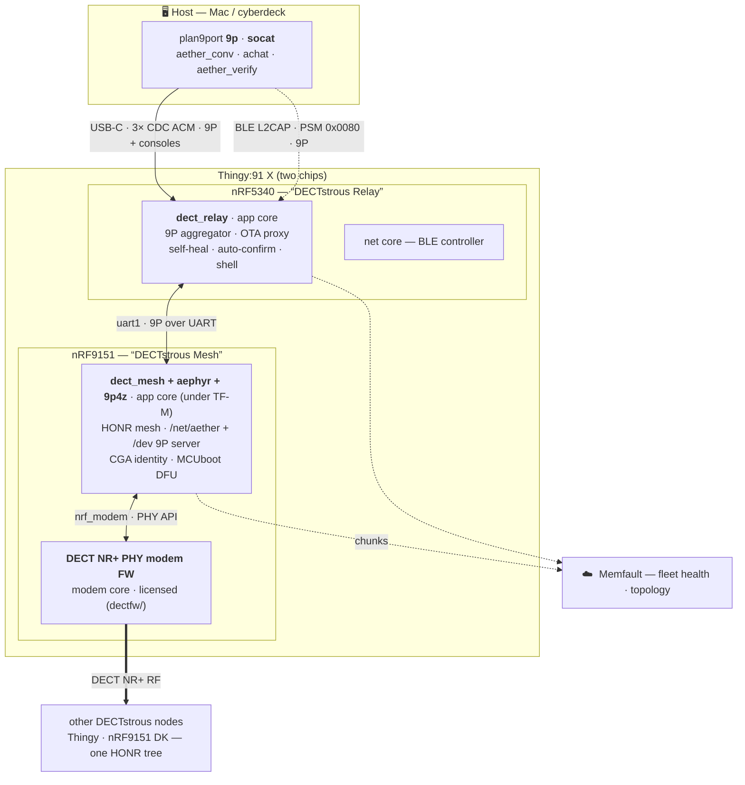
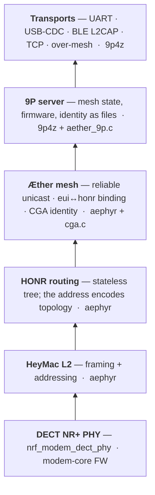

# Architecture — the moving parts

How a DECTstrous mesh fits together end to end: the host, the two chips on a
Thingy:91 X (each with its own firmware), the transports between them, the radio
mesh, and the cloud. For the 9P namespace itself (`/net/aether`, `/dev/*`), see the
top-level [`README.md`](../README.md); for the on-hardware proofs, [`PROOF.md`](PROOF.md).

## System view

The relay is a **9P aggregator**: a 9P *server* to the host (over USB and BLE at once)
and a 9P *client* to the 9151 (over the inter-chip UART). That one role gives a chip
with no USB a full, field-updatable control surface — the host writes `/dev/fw9151`
and the relay proxies the file write across the UART to the 9151's own DFU.

## Firmware, per component

Each core runs its own image. The `dectfw/` modem firmware is licensed and access-gated
— never committed, flashed once, and never wiped.

| Chip · core | Firmware | Flashed / updated |
|-------------|----------|-------------------|
| **nRF5340 · app core** | MCUboot + `dect_relay` | J-Link once, then **self-DFU over USB** — `9p write /dev/fw5340` |
| **nRF5340 · net core** | Bluetooth LE controller (built via sysbuild) | with the app image |
| **nRF9151 · app core** | MCUboot + TF-M (minimal) + `dect_mesh` (with `aephyr` + `9p4z`) | J-Link once, then **OTA over 9P** — `9p write /dev/fw9151`, relay auto-confirms |
| **nRF9151 · modem core** | DECT NR+ PHY modem FW (`nrf_modem_dect_phy`) | one-time SWD; `flash-thingy.sh` **refuses to recover** the 9151 so it can't be wiped |

**The update model in one line:** one J-Link bring-up per node, then a node never needs
a debugger again — the relay self-DFUs over USB, and the 9151 updates over the air, both
as 9P file writes. See [`OTA.md`](OTA.md).

## Software stack (nRF9151 app core)

Bottom-up: the radio at the base, the mesh built on it, and 9P exposing the whole thing
as files over any transport. `aephyr` and `9p4z` are out-of-tree Zephyr modules.

- **HONR routing** — addresses are the topology, so forwarding is arithmetic; no route
  tables to converge, and the tree self-heals on root loss.
- **CGA identity** — `node_eui = SHA256(pubkey)[:6]`, bound to a per-node P-256 key
  (persisted in NVS, signed on the on-die PSA/Oberon crypto). Self-certifying: no PKI.
- **9P over any transport** — the same namespace is served over the inter-chip UART, host
  USB-CDC, BLE L2CAP, TCP, and across the mesh itself. Swap the transport; the semantics
  don't move — the PHY is an implementation detail below the filesystem.

## Transports at a glance

| Link | Carries | Notes |
|------|---------|-------|
| USB-C · 3× CDC ACM | 9P (`*103`) + two consoles (`*101` 9151, `*105` 5340) | host ⇄ relay; raw 9P, bridge with `socat …,rawer` |
| BLE L2CAP (PSM `0x0080`) | the *same* `/dev` 9P namespace | host ⇄ relay; registered alongside USB at boot |
| uart1 · inter-chip | 9P over UART | relay ⇄ 9151; the relay rate-matches this link for OTA |
| DECT NR+ RF | HeyMac/HONR frames · reliable unicast · flooded broadcast | 9151 ⇄ peers; US band 4 (915 MHz) or band 9 (1.9 GHz) |

## The two modules

Both apps consume the same out-of-tree Zephyr modules via `ZEPHYR_EXTRA_MODULES`:

- **`aephyr`** — the Æther / HeyMac / HONR mesh stack **and** the DECT NR+ PHY driver.
  The portability point: this is a port of a proven LoRa mesh; the routing and MAC logic
  moved to DECT NR+ essentially unchanged.
- **`9p4z`** — the 9P library for Zephyr: server, client, and the UART / USB / BLE L2CAP /
  TCP transports.
