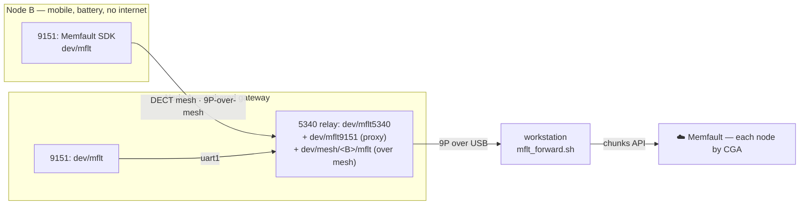

# Field test run-book — roaming telemetry over the mesh

Keep this on the laptop/cyberdeck during the run. Multi-hop routing, party-line chat,
reliable ARQ, and self-heal are **already proven** (bench + first neighborhood run). This
exercise is about the next thing: **take the battery nodes out into the neighborhood and
capture real telemetry the whole time** — and prove that a *mobile, untethered* node's
telemetry reaches the cloud **through the mesh and the gateway's composed 9P namespace**.

The headline: **Node B roams on battery with no internet, no LTE, no USB — and its
coredumps and RF metrics still land in Memfault**, keyed to its cryptographic identity,
because the DECT mesh carries them to the tethered gateway and the gateway forwards them.

**Deployed firmware:** universal `dect_mesh` **0.7.41** (9151) + `dect_relay` **0.38.28**
(5340), carrier **538** (band 4, ~915 MHz), **CGA** identity, **Memfault instrumented on
both chips**. Self-organizing — no per-node config. `dect txpower` runtime lever intact.

## Roles
```
  Node A (gateway)                DK (relay, optional)      Node B (mobile)
  desk window, USB-tethered       stop sign ~1/4 mi         battery + cyberdeck, roaming
  = gateway + forwarder           external battery          telemetry rides the mesh home
        \________ ~1/4 mi ________/   \____ ~1/4 mi, around the wooded hill ____/
                  (in range)                      (in range)
        \_______________ NOT in range (hillside isolates the ends) _____________/
```
- **Node A — tethered gateway.** Stays on the desk, USB to the workstation. Runs the
  forwarder continuously. This is the *only* node that needs a host. It ships **its own**
  two chips' telemetry **and relays Node B's over the mesh** (see below).
- **Node B — the mobile node.** Battery, roaming. No host, no internet. Its 9151 keeps
  meshing and serving telemetry; the DK (or terrain) forces the relayed path.
- **DK — optional cut-vertex relay.** Battery at the stop sign to force a 2-hop path when
  you want to show multi-hop relaying of *both* traffic and telemetry.

## The telemetry pipeline in the field



1. **Gateway self-telemetry — WORKS TODAY.** Node A's relay multiplexes *its own* two chips
   (`dev/mflt5340` + `dev/mflt9151`) into one 9P namespace; `tools/mflt_forward.sh` drains
   both over one connection and POSTs to Memfault. Two devices, one forwarder.
2. **Mesh-relayed telemetry — WORKS.** List a mobile node's CGA in `MESH_PEERS` and each
   cycle the forwarder tunnels a 9P session through Node A's conversation layer to that
   peer's **mesh 9P server** (`aether_conv --bridge`, addressed by durable CGA so routing
   re-resolves as the node roams) and drains its `dev/mflt` **over the DECT mesh**. `dev/mflt`
   is already served over the mesh on every node (the mesh 9P server shares the same
   namespace), so **Node B needs zero firmware change**. Because every stream is
   **self-describing** (`DEV:dect-<CGA>:` before its `MC:` chunks), B's data POSTs to **B's**
   Memfault device automatically. Proven end-to-end: Node B's chunks reach Memfault (HTTP
   200) through Node A over the air, no tether. Run it:
   ```sh
   MESH_PEERS="<B-cga e.g. 36:0a:45:63:c7:17>" \
     MEMFAULT_PROJECT_KEY=<key> tools/mflt_forward.sh <A 9P port> 15
   # cycle summary tallies chunks per device: "...: 2xdect-<A> 1xdect-<B> 2xdect-relay-<A>"
   ```

> **Why this is the whole thesis at once:** 9P-over-mesh (the mesh carries a real session,
> not just chat) + namespace composition (B's files appear inside A's tree) + self-certifying
> identity (the CGA routes the data to the right device) — all doing production work:
> observing a node that has no other way to reach the cloud.

## ⚠️ THE GOLDEN RULE (or you'll fight ghosts all day)
**One `socat`/forwarder bridge on the gateway, held — never cycle it.** Bring it up once,
leave it up for the whole run. Do NOT `pkill socat; socat …` between commands. Repeated
open/close toggles DTR, wedges the USB-CDC peripheral, and produces `operation not
permitted` / timeouts / `bad rpc tag` that *look* like mesh failures but are local-port
abuse. If a port wedges, **power-cycle that node.** (See `doc/OTA.md`.) The forwarder is
built to hold one session per cycle for exactly this reason.

## Setup (gateway, before you walk out)
```sh
# One held bridge for ad-hoc 9P (tree/chat/aether_conv), if you want a live vantage:
NINEP=~/src/plan9port/bin/9p
P=/dev/cu.usbmodem*3            # Node A's 9P port (the *3 one); pin it, don't glob loosely
socat UNIX-LISTEN:/tmp/9p.sock,fork "$P",rawer &   # leave it up

# The telemetry forwarder — the thing that runs the WHOLE exercise.
# Port = Node A's relay 9P USB-CDC port. Interval tightened for the roam (see cadence).
MEMFAULT_PROJECT_KEY=<project key> tools/mflt_forward.sh <9P port> 10
```
Power on all nodes; give ~60 s to self-organize. From Node A's console (`*5` relay or `*1`
9151 console): `aether tree` to confirm the mesh formed before anyone walks off.

## Telemetry cadence for the roam
High-resolution so you can correlate link quality against *where B is*:
- **On-device heartbeat:** 60 s → **15 s** for the run (`CONFIG_MEMFAULT_METRICS_HEARTBEAT_INTERVAL_SECS`).
- **Metrics collector:** 30 s → **15 s** (`dect_metrics.c` reschedule) so a heartbeat never
  reports a stale snapshot.
- **Forwarder:** `10` s interval (arg above) so chunks reach the cloud minutes-fresh.
Coredumps and reboot reasons are event-driven regardless — they flush on the next cycle.

## What to watch — the field data

Each node appears in Memfault **by its CGA** (`dect-<12 hex>`), symbolicated (symbols
uploaded per version). As B roams:

**1. RF telemetry vs. range** — the payload. From the DECT PHY, per heartbeat:
- `dect_rssi` / `dect_snr` — link quality falling off as B walks out.
- `dect_lbt_busy` — listen-before-talk deferrals (channel contention) — ties to
  `doc/RF_CHARACTERIZATION.md`.
- `dect_tx_ok` / `dect_tx_err` — PHY transmit outcomes.
- `dect_temp` — modem temperature (thermal behavior on battery, in the sun).
- `dect_carrier` / `dect_tx_power` — the RF regime (fleet filter axes).

**2. Mesh health on the timeline** — as B goes out of range and comes back:
- `dect_honr_joined`, `dect_honr_rank`, `dect_neighbors`, `dect_routes` trend.
- **Trace events** `Dect_Orphan` / `Dect_Reelection` fire exactly when B loses/regains the
  tree — scrub the timeline and *see* the self-heal against the walk.
- `dect_forwarded` on the DK — direct evidence it relayed while you were out there.

**3. Mesh-relayed observability — the demo.** Node B's device in Memfault populates
**entirely through Node A** — B never touched a host. Confirm B's `dect-<CGA>` device shows
fresh heartbeats and its RF metrics while it's a quarter-mile away on battery.

**4. Coredump from the field.** If a node faults during the run, its coredump is captured,
carried home (over the mesh for B), and symbolicated in the UI — a real fault, real stack,
from the neighborhood.

### Live vantage (optional, over the held bridge)
Still useful alongside Memfault:
```
aether status                 # neighbors (no Node B once out of range) + routes (B at hops 2 via DK)
aether chat hello from desk   # party-line across the relay → appears on B's cyberdeck
tools/field_metrics.sh /dev/cu.usbmodem*1 10 field_run.csv   # local CSV, timestamp-correlate with position
```

## Tuning (if the topology won't force the relay)
- **Ends still hear each other** (no relay forced) → `dect txpower 11` (or lower) on the
  nodes; reposition behind more obstruction (the wooded hillside is the intended isolator).
- **A hop won't close** (a node can't reach the DK) → `dect txpower 13` (max) and/or move it closer.
- `dect txpower` is **not persisted** — re-set after any power-cycle (or it's the baked-in default).

## Capturing location (simplified — log, don't resolve)
At each of B's stops, have the cyberdeck record **(GPS position, visible WiFi AP
BSSIDs+RSSI, the node's mesh state)**. Offline, correlate AP scans → position, then overlay
against the Memfault RF timeline (both are timestamped). No live nRF Cloud needed.

## If something wedges
- Gateway port `operation not permitted` / hangs → you cycled the bridge; **power-cycle Node
  A**, bring up **one** held bridge, restart the forwarder.
- A node dropped off mesh → check `dect stats` (tx err should be ~0 at max power; LBT `busy`
  is normal), confirm carrier 538.
- Node B's inter-chip 9P link is the flaky one under saturation — fine for meshing and for
  the periodic mesh-relayed telemetry; it only bites if you try to OTA it over USB mid-run.
- **Mesh-relay telemetry stalls** → B's chunks are best-effort over the mesh; a dropped
  cycle just retries next interval. A *sustained* gap = B is out of range (which is itself
  data — expect it to resume when B walks back).

---
*Reference: `doc/OBSERVABILITY.md` (metric catalog + pipeline), `doc/OTA.md` (port
discipline), `doc/RF_CHARACTERIZATION.md` (the on-device RF metrics are the complement to
the SDR captures), `dect_mesh/` (firmware), `tools/mflt_forward.sh`,
`tools/field_metrics.sh`, `tools/aether_conv.c`.*
