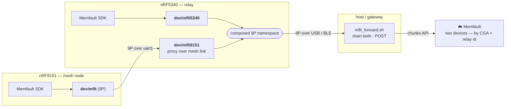

# Observability — fleet health by construction (Memfault)

*Coming from nRF Cloud, with Memfault in-house, the differentiator isn't "we added
telemetry" — it's that **every node is already a 9P filesystem, so the observability
pipeline is reading files**, not a new protocol per metric. This spec defines what we
surface, why (which claim each metric backs), how it reaches Memfault, and what a
Nordic reviewer sees when they log in.*

## Two jobs for the data

1. **Back the claims with real fleet data.** Self-organization, multi-hop, reliable
   transport, cryptographic identity, cross-PHY — each should be visible as a chart
   from actual devices, not just a bench transcript.
2. **Keep us on track as it scales.** The same metrics are the operational early-warning
   system: a wedged node, a churning tree, an RF-starved link, a reliability regression
   — spotted in the fleet view before they become "why is the demo broken."

## The pipeline — getting data off a radio with no internet

A mesh node runs the **DECT NR+ PHY** on its modem core; it has **no LTE, no IP, no
direct cloud path**. Memfault already solves this: the SDK **packetizes** metrics,
reboot reasons, traces, and coredumps into transport-agnostic **chunks**. We just have
to move the chunks — and everything in this project is a file, so the chunks are a file
too:

**Both chips are instrumented**, and the relay **multiplexes both chunk streams into its
one 9P namespace** — so a single forwarder drains two devices' telemetry over one
connection:

- **Both chips packetize.** The 9151 exposes its chunks as `dev/mflt`; the relay exposes
  its own (coredumps, reboot reasons, metrics) as `dev/mflt5340` and **proxies the 9151's
  over the inter-chip mesh link** as `dev/mflt9151`. Reading a file drains its chunks.
- **Self-describing streams.** Each emits a `DEV:<serial>:` line before its `MC:<base64>:`
  chunks (the 9151's serial is its CGA; the relay's is `dect-relay-<hwid>`), so one generic
  forwarder POSTs any chip's chunks to the right device without being told who it is.
- **One forwarder, one namespace, two chips.** `tools/mflt_forward.sh` drains
  `dev/mflt5340` + `dev/mflt9151` over a single 9P connection and POSTs to Memfault. On the
  bench the tethered host runs it; in the field an LTE gateway does. The existing relay
  `mflt export` console command stays — for manual triage only.

> **The 9P thesis, standalone.** Two chips' coredumps and metrics, pulled through *one
> composed namespace* over the multiplexed UART/USB link — no per-device telemetry code,
> no second protocol. This sells the filesystem-composition idea *entirely apart* from the
> DECT mesh: observability falls out of the model.

## Metric catalog — mapped to the claim each one backs

Heartbeat metrics (reported every interval). **Source** shows where the value comes
from: *ctx* = `aether_mesh_ctx` (harvested today), *heymac* = HeyMac L2 context
(available, not yet reported), *new* = a counter to add in aephyr/the driver.

### Self-organization &amp; self-healing  — *"pull any node, it re-forms itself"*
| Metric | Type | Source | Backs / signals |
|--------|------|--------|-----------------|
| `dect_honr_joined` | bool | ctx ✓ | node is in a tree (fleet "everyone converged") |
| `dect_honr_rank` | uint | ctx ✓ | tree depth; how deep the mesh got |
| `dect_is_root` | bool | ctx | which/how-many nodes are root (should be exactly one per partition) |
| `dect_neighbors` | uint | ctx ✓ | local connectivity density |
| `dect_reelections` | uint | new | **self-heal rate** — root losses recovered (the money metric) |
| `dect_parent_changes` | uint | new | topology churn — high = unstable placement |
| `dect_orphan_events` | uint | new | how often a node lost its tree |
| `dect_time_to_join_ms` | uint | new (timer) | **reconvergence latency** after a disruption |

### Multi-hop routing  — *"it relays"*
| Metric | Type | Source | Backs / signals |
|--------|------|--------|-----------------|
| `dect_routes` | uint | ctx ✓ | reachable destinations |
| `dect_forwarded` | uint | ctx ✓ | **packets this node relayed** — direct evidence of multi-hop |
| `dect_dropped` | uint | ctx ✓ | TTL/no-route drops |
| `dect_max_hops_seen` | uint | new | deepest delivered path — proves >1 hop in the field |

### Reliable transport (ARQ)  — *"acknowledged, in-order, de-duplicated"*
| Metric | Type | Source | Backs / signals |
|--------|------|--------|-----------------|
| `dect_data_sent` / `dect_data_recv` | uint | ctx/new | datagram volume |
| `dect_arq_retx` | uint | new | retransmissions — link quality proxy |
| `dect_arq_failed` | uint | new | deliveries that gave up — **reliability KPI (should be ~0)** |
| `dect_dup_dropped` | uint | new | dedup working |
| `dect_rxq_full_drops` | uint | new | conversation rxq overflow — the load/back-pressure signal from the inter-chip work |

### RF / PHY health (DECT NR+)  — *"PHY-aware, and honest about the air"*
| Metric | Type | Source | Backs / signals |
|--------|------|--------|-----------------|
| `dect_rssi_last` | int | heymac | link signal strength |
| `dect_snr_last` | int | heymac | link quality |
| `dect_tx_ok` / `dect_tx_err` | uint | heymac/new | PHY transmit outcomes |
| `dect_lbt_busy` | uint | new | **listen-before-talk deferrals** — channel contention; ties to `doc/RF_CHARACTERIZATION.md` |
| `dect_tx_airtime_ms` | uint | new | transmit on-time per interval → **live duty-cycle proxy** (regulatory relevance) |

### 9P / inter-chip control plane  — *"the filesystem stays up"*
| Metric | Type | Source | Backs / signals |
|--------|------|--------|-----------------|
| `dect_9p_requests` | uint | new (9p4z) | control-plane activity |
| `dect_link_resyncs` | uint | new | uart1 framer resyncs — inter-chip reliability |
| `dect_link_wedges` | uint | new | mesh_client wedge/reset events — the failure mode to watch at scale |

### System health  — *free from the Memfault SDK*
- **Reboot reasons** (every reset is categorized: crash, watchdog, brownout, request).
- **Coredumps** on fault — full register + stack capture, symbolicated in the UI.
- **Heap / stack high-water** (add the mesh workq + 9P processing-thread stacks).
- **Uptime**, firmware version — built in.

## Device attributes (identity, set once / on change)

Not time-series — the fleet's *filter and group* axes:

| Attribute | Value | Why it's powerful |
|-----------|-------|-------------------|
| `cga_addr` | `36:0a:45:63:c7:17` | **filter the fleet by cryptographically-generated identity** — the CGA *is* the device's name in the dashboard |
| `fw_version` | `0.7.38` | regression tracking across OTA |
| `dect_band` / `dect_carrier` | band 4 / 538 | group by RF regime |
| `dect_tx_power_idx` | index | correlate power with RSSI/reach |
| `node_role` | root / child | slice self-organization behavior |

## Trace events (discrete, timestamped)

Beyond periodic metrics — the *story* of a node's life, on a timeline:
`root_elected`, `orphaned`, `rejoined`, `link_wedge` / `link_recovered`, `lbt_storm`
(sustained contention), `ownership_proof_served` (an identity challenge answered).
These turn "the mesh healed" into a timeline a reviewer can scrub.

## The dashboard — what a Nordic reviewer sees

A **fleet-health-at-a-glance** view backed by the metrics above:

- **Convergence:** % of fleet with `dect_honr_joined=1`; exactly one `dect_is_root` per
  partition; `dect_reelections` as a self-heal counter — *the self-organization claim, live.*
- **Multi-hop:** `dect_forwarded` and `dect_max_hops_seen` across the fleet — *relaying, in the field.*
- **Reliability:** `dect_arq_failed` (alert if &gt; 0) and `dect_rxq_full_drops` trend — *the transport KPI.*
- **RF:** `dect_rssi_last` / `dect_snr_last` distributions, `dect_lbt_busy` and
  `dect_tx_airtime_ms` — *link health + the live duty-cycle proxy.*
- **Stability:** reboot-reason breakdown, coredump count, `dect_link_wedges` — *does it stay up at scale.*
- **Alerts:** `dect_arq_failed &gt; 0`, `dect_link_wedges` rising, a node stuck
  `honr_joined=0`, or a coredump — the operational early-warning set.

Each panel maps to a claim in the pitch, so the dashboard *is* the proof, continuously
refreshed from real devices — exactly the "log in and see it" experience.

## Phasing (honest status)

- **Phase 1 — DONE (built, `dect_metrics.c` + heartbeat def):** the device serial is now
  the **CGA** (`dect-<node_eui>` — cryptographic identity = fleet device name), plus the
  harvested metrics — `dect_is_root`, `dect_rssi`, `dect_snr`, `dect_tx_err`, `dect_rx_err`,
  `dect_carrier`, `dect_tx_power` — on top of the original 8. No aephyr changes.
- **Pipeline — DONE (built), both chips:** the 9151 exposes `dev/mflt` (`aether_9p.c`); the
  relay exposes its own `dev/mflt5340` and proxies the 9151's as `dev/mflt9151` (both in
  `dect_relay/main.c`), and sets its serial to `dect-relay-<hwid>`. Each stream is
  self-describing (`DEV:<serial>:` + `MC:<base64>:`), and `tools/mflt_forward.sh` drains
  both over one 9P connection and POSTs to Memfault.
- **To go live (needs your input):** set `CONFIG_MEMFAULT_NCS_PROJECT_KEY` (or pass the key
  to the forwarder), OTA the 0.7.39 image, and run `MEMFAULT_PROJECT_KEY=… mflt_forward.sh
  <9P port>` → **real data in Memfault.** Then build the dashboard above.
- **Phase 2 — DONE (dect_mesh 0.7.41):** aephyr counters `reelections`, `orphans`,
  `arq_retx`, `arq_failed` (in the HONR election/orphan + ARQ send paths), plus the
  datagram counters `data_tx`/`data_rx`/`rxq_drops` harvested from dect_mesh's own
  `aether_net`. And **trace events** — `Dect_Reelection`, `Dect_Orphan`, `Dect_ArqFailed`
  — emitted from `dect_metrics.c` when a counter steps (aephyr stays Memfault-free; the
  app translates counter deltas into timeline events).
- **Phase 2b (still to do):** the driver-level RF counters (`lbt_busy`, `tx_airtime_ms`,
  `tx_ok`) need hooks in the DECT PHY driver; and 9P/inter-chip counters (`9p_requests`,
  `link_resyncs`, `link_wedges`) in 9p4z.

## References
`../dect_mesh/src/dect_metrics.c`, `../dect_mesh/config/memfault_metrics_heartbeat_config.def`,
`doc/ARCHITECTURE.md` (where Memfault sits), `doc/RF_CHARACTERIZATION.md` (the airtime/LBT
metrics are the on-device complement to the SDR captures). Memfault: Metrics, Trace Events,
Reboot Reasons, Coredumps, Device Attributes, and the chunks/`POST` ingestion API.
